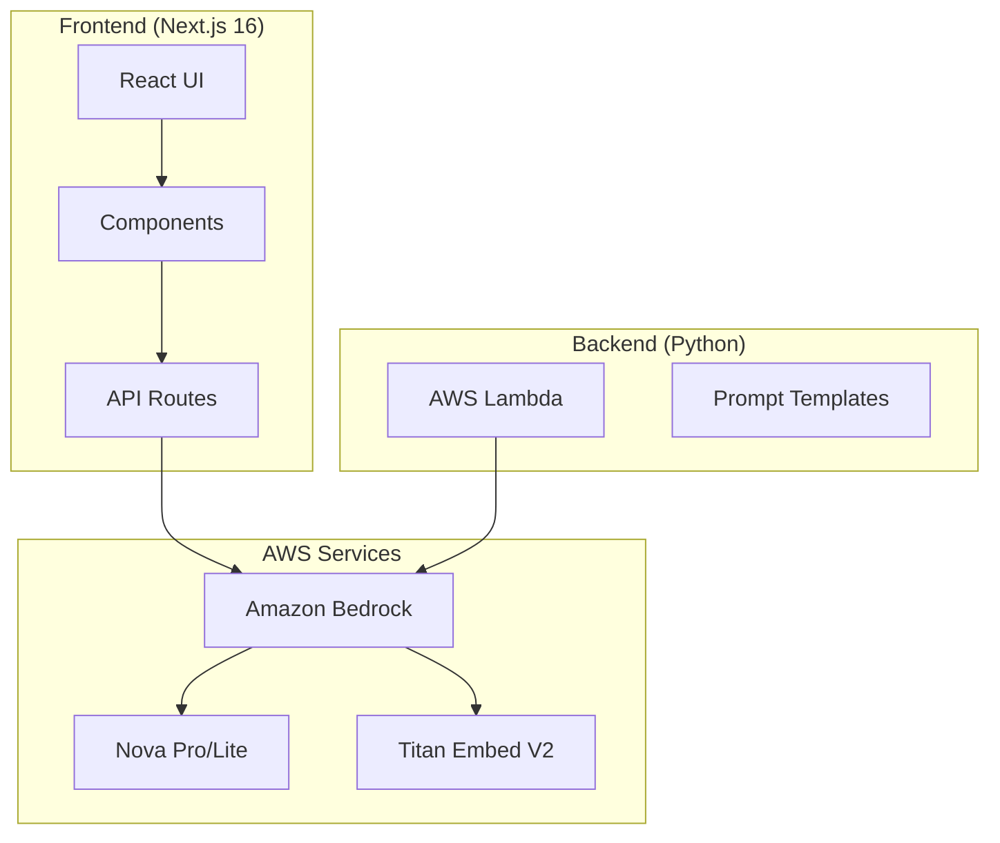
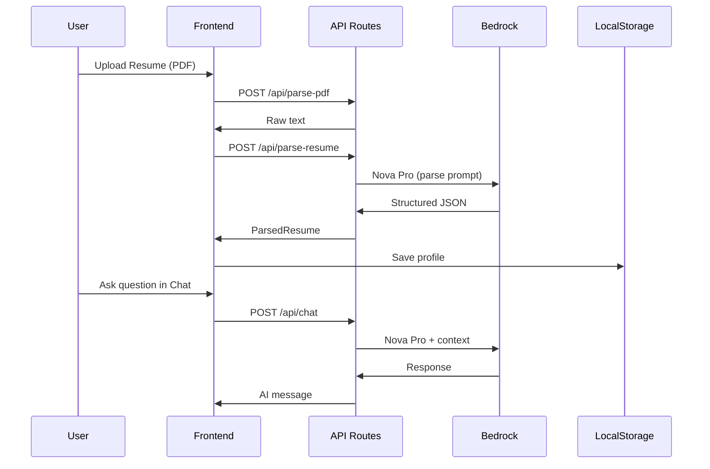

# CareerPath AI - Complete Technical Documentation

> **AI-Powered Career Mentorship Platform**  
> Built for the Amazon Bedrock Hackathon 2026

---

## 📋 Table of Contents

1. [Overview](#overview)
2. [Architecture](#architecture)
3. [Technology Stack](#technology-stack)
4. [Features](#features)
5. [Amazon Bedrock Integration](#amazon-bedrock-integration)
6. [API Endpoints](#api-endpoints)
7. [Components](#components)
8. [Ethical AI & XAI Features](#ethical-ai--xai-features)
9. [Data Flow](#data-flow)
10. [Project Structure](#project-structure)

---

## 🎯 Overview

CareerPath AI is an intelligent career mentorship platform that uses **Amazon Bedrock foundation models** to provide personalized career guidance. Users upload their resume, and the AI analyzes their skills, identifies gaps, and generates a customized 12-week career roadmap.

### Key Capabilities

| Feature | Description |
|---------|-------------|
| **Resume Analysis** | AI-powered extraction of skills, experience, and certifications |
| **Smart Matching** | Match user profiles to target job roles |
| **Skill Gap Analysis** | Identify missing skills for target positions |
| **Career Roadmap** | Week-by-week actionable learning plan |
| **AI Chat Mentor** | Conversational career guidance |
| **Ethical XAI Panel** | Transparent, explainable AI decisions |

---

## 🏗️ Architecture



---

## 🛠️ Technology Stack

### Frontend

| Technology | Version | Purpose |
|------------|---------|---------|
| **Next.js** | 16.1.6 | React framework with App Router |
| **React** | 19.2.3 | UI library |
| **TypeScript** | 5.x | Type-safe JavaScript |
| **TailwindCSS** | 4.x | Utility-first CSS framework |
| **Lucide React** | 0.563.0 | Icon library |
| **Recharts** | 3.7.0 | Data visualization charts |
| **React Dropzone** | 14.3.8 | File upload handling |
| **React Markdown** | 10.1.0 | Markdown rendering |

### AWS Services

| Service | Model/Resource | Purpose |
|---------|----------------|---------|
| **Amazon Bedrock** | - | Foundation model access |
| **Amazon Nova Pro** | `amazon.nova-pro-v1:0` | Primary text generation |
| **Amazon Nova Lite** | `amazon.nova-lite-v1:0` | Fast, lightweight responses |
| **Amazon Nova Micro** | `amazon.nova-micro-v1:0` | Quick operations |
| **Amazon Titan Embed V2** | `amazon.titan-embed-text-v2:0` | Text embeddings |
| **AWS Lambda** | Python 3.12 | Serverless functions |

### PDF Processing

| Library | Purpose |
|---------|---------|
| **pdfjs-dist** | PDF parsing in browser |
| **unpdf** | PDF text extraction |

---

## ✨ Features

### 1. Resume Upload & Analysis

```
User uploads PDF/DOCX → PDF.js extracts text → Bedrock Nova Pro parses → JSON profile created
```

**Extracted Data:**
- Personal information (name, email, phone)
- Work experience with duration
- Technical and soft skills
- Education and certifications
- Career level detection
- Primary domain identification

### 2. AI Chat Mentor

Interactive conversational interface powered by Amazon Nova Pro. Users can:
- Ask career-related questions
- Get personalized advice based on their resume
- Request skill development recommendations
- Generate custom learning roadmaps

### 3. Skill Gap Analysis

Visual radar chart comparing:
- **Current Skills** (from resume)
- **Target Role Requirements** (AI-generated)
- **Gap Percentage** (calculated difference)

### 4. 12-Week Career Roadmap

AI-generated week-by-week plan with:
- Learning milestones
- Specific tasks and resources
- Time estimates per week
- Progress tracking

### 5. Resume Annotation

Interactive visual feedback showing:
- Strengths highlighted in the resume
- Areas for improvement
- Specific enhancement suggestions

---

## 🤖 Amazon Bedrock Integration

### Models Used

```typescript
export const MODELS = {
    generation: {
        NOVA_PREMIER: 'amazon.nova-premier-v1:0',
        NOVA_PRO: 'amazon.nova-pro-v1:0',      // Primary
        NOVA_LITE: 'amazon.nova-lite-v1:0',    // Fast responses
        NOVA_MICRO: 'amazon.nova-micro-v1:0',
        TITAN_LARGE: 'amazon.titan-tg1-large',
    },
    embedding: {
        TITAN_EMBED_V2: 'amazon.titan-embed-text-v2:0',  // Primary
        TITAN_EMBED_V1: 'amazon.titan-embed-text-v1',
    },
};
```

### Model Selection Strategy

| Task | Model | Reason |
|------|-------|--------|
| Resume Parsing | Nova Pro | Complex extraction, high accuracy |
| Chat Responses | Nova Pro | Nuanced, contextual responses |
| Ethical Evaluation | Nova Pro (temp=0.3) | Consistent, reliable results |
| Quick Operations | Nova Lite | Speed for simple tasks |
| Embeddings | Titan Embed V2 | 1024-dim vectors, normalized |

### Request Format (Nova)

```typescript
const requestBody = {
    messages: [
        {
            role: 'user',
            content: [{ text: prompt }]
        }
    ],
    inferenceConfig: {
        maxTokens: 4096,
        temperature: 0.7,
        topP: 0.9,
    }
};
```

---

## 🔌 API Endpoints

### `/api/parse-pdf` (POST)
Extracts raw text from PDF files using pdfjs-dist.

**Input:** `{ file: File }`  
**Output:** `{ text: string }`

### `/api/parse-resume` (POST)
Parses resume text into structured JSON using Bedrock.

**Input:** `{ resumeText: string }`  
**Output:** `{ parsedResume: ParsedResume }`

### `/api/analyze-resume` (POST)
Performs comprehensive resume analysis.

**Input:** `{ resumeText: string, targetRole?: string }`  
**Output:** `{ analysis: ResumeAnalysis }`

### `/api/chat` (POST)
AI chat endpoint for career mentorship.

**Input:** `{ message: string, userProfile?: ParsedResume, history?: Message[] }`  
**Output:** `{ response: string }`

### `/api/ethical-evaluation` (POST)
Ethical AI evaluation with XAI explanations.

**Input:** `{ resumeText: string, targetRole: string }`  
**Output:** `{ evaluation: EthicalEvaluation, xai: XAIExplanation }`

---

## 🧩 Components

### Core Components

| Component | File | Purpose |
|-----------|------|---------|
| **ResumeUpload** | `ResumeUpload.tsx` | Drag-drop file upload with PDF preview |
| **ChatInterface** | `ChatInterface.tsx` | AI chat with message history |
| **SkillGapChart** | `SkillGapChart.tsx` | Radar chart for skill comparison |
| **RoadmapTimeline** | `RoadmapTimeline.tsx` | 12-week career plan visualization |
| **EthicalXAIPanel** | `EthicalXAIPanel.tsx` | Explainable AI transparency panel |
| **ResumeAnnotationModal** | `ResumeAnnotationModal.tsx` | Resume feedback overlay |

### Pages

| Page | Route | Description |
|------|-------|-------------|
| **Landing** | `/` | Hero, features, resume upload |
| **Dashboard** | `/dashboard` | Skill gaps, roadmap, profile stats |
| **Chat** | `/chat` | AI mentor conversation interface |

---

## 🛡️ Ethical AI & XAI Features

### Explainable AI Panel

The `EthicalXAIPanel` component provides transparency:

1. **Model Disclosure** - Shows which Bedrock model is being used
2. **Decision Factors** - Lists factors influencing AI recommendations
3. **Confidence Scores** - Displays AI confidence levels
4. **Bias Detection** - Monitors for potential bias in responses
5. **Human Review** - Flags edge cases for human verification

### Ethical Considerations

```typescript
const ETHICAL_CHECKS = [
    'No discrimination based on protected characteristics',
    'Transparent AI decision-making',
    'User data privacy protection',
    'Confidence thresholds for recommendations',
    'Human-in-the-loop for critical decisions'
];
```

### Temperature Settings

| Use Case | Temperature | Rationale |
|----------|-------------|-----------|
| Ethical Evaluation | 0.3 | Consistent, deterministic |
| Chat Responses | 0.7 | Creative but grounded |
| Resume Parsing | 0.5 | Accurate extraction |

---

## 🔄 Data Flow



---

## 📁 Project Structure

```
career-path-ai/
├── frontend/
│   ├── src/
│   │   ├── app/
│   │   │   ├── api/
│   │   │   │   ├── analyze-resume/route.ts
│   │   │   │   ├── chat/route.ts
│   │   │   │   ├── ethical-evaluation/route.ts
│   │   │   │   ├── parse-pdf/route.ts
│   │   │   │   └── parse-resume/route.ts
│   │   │   ├── chat/page.tsx
│   │   │   ├── dashboard/page.tsx
│   │   │   └── page.tsx
│   │   ├── components/
│   │   │   ├── ChatInterface.tsx
│   │   │   ├── EthicalXAIPanel.tsx
│   │   │   ├── ResumeAnnotationModal.tsx
│   │   │   ├── ResumeUpload.tsx
│   │   │   ├── RoadmapTimeline.tsx
│   │   │   └── SkillGapChart.tsx
│   │   └── lib/
│   │       ├── bedrock.ts
│   │       └── types.ts
│   ├── public/
│   │   └── logo.png
│   └── package.json
├── backend/
│   ├── lambda/
│   └── prompts/
├── infrastructure/
│   └── (AWS CDK/SAM templates)
└── docs/
```

---

## 🎨 Design System

### Color Palette (Purple Theme)

| Color | Tailwind Class | Hex | Usage |
|-------|----------------|-----|-------|
| Primary | `purple-500` | `#a855f7` | Buttons, accents |
| Secondary | `purple-400` | `#c084fc` | Icons, highlights |
| Dark | `purple-600` | `#9333ea` | Gradients |
| Background | `gray-950` | `#030712` | Page background |
| Surface | `gray-800` | `#1f2937` | Cards |

### Visual Effects

- **Glow Orbs** - Blurred purple circles for ambient lighting
- **Wave SVGs** - Animated wavy backgrounds
- **Glassmorphism** - Backdrop blur on cards
- **Gradient Text** - Purple-to-pink gradient headings

---

## 🚀 Running the Project

### Prerequisites

- Node.js 18+
- AWS CLI configured with Bedrock access
- AWS credentials with `bedrock:InvokeModel` permission

### Development

```bash
cd frontend
npm install
npm run dev
```

### Environment Variables

```bash
AWS_ACCESS_KEY_ID=your_access_key
AWS_SECRET_ACCESS_KEY=your_secret_key
AWS_REGION=us-east-1
```

---

## 📊 Hackathon Compliance

### Amazon Bedrock Requirements ✅

- [x] Uses Amazon Bedrock as primary AI service
- [x] Nova Pro for text generation
- [x] Titan Embed V2 for embeddings
- [x] Deployed in `us-east-1` region

### Innovation Highlights

1. **Ethical XAI Panel** - Transparent AI decision-making
2. **Multi-model Architecture** - Right model for each task
3. **Interactive Resume Annotation** - Visual feedback
4. **Personalized Roadmaps** - Week-by-week career plans

---

## 📝 License

MIT License - Built for Amazon Bedrock Hackathon 2026

---

*Built with ❤️ using Amazon Bedrock, Next.js, and React*
