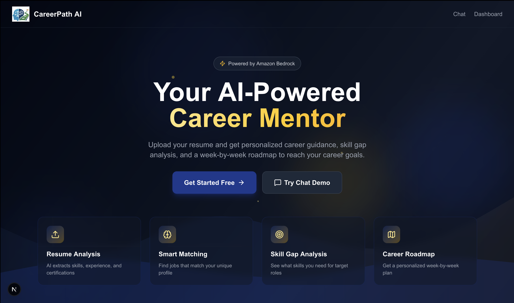
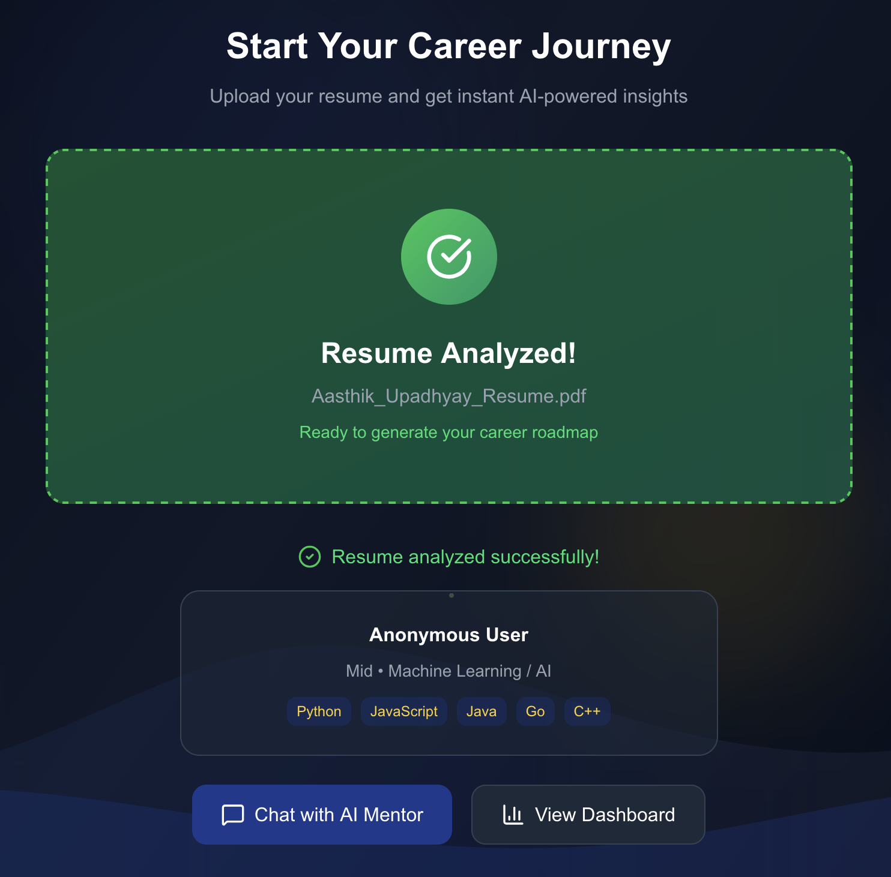
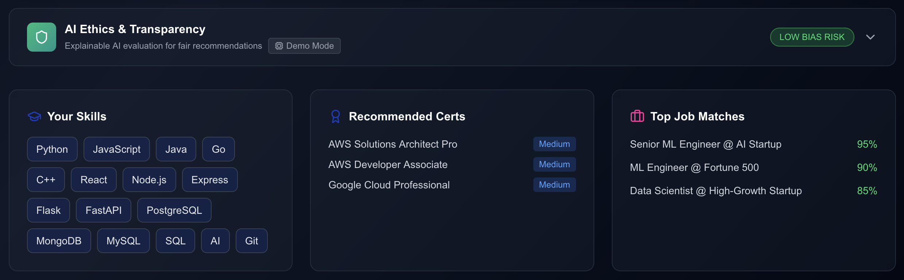
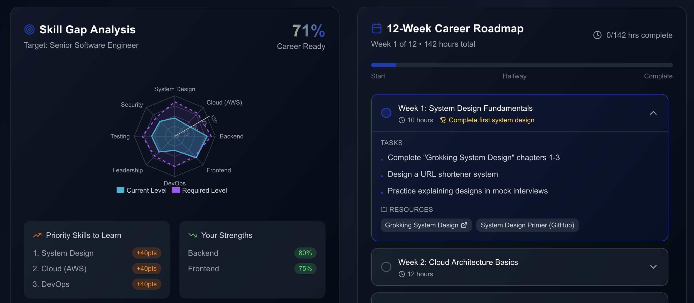

# CareerPath AI

> **An Agentic RAG-Based Career Mentor Powered by Amazon Bedrock**

[](https://aws.amazon.com/bedrock/)
[](https://nextjs.org/)
[](https://aws.amazon.com/cdk/)

CareerPath AI is an intelligent career mentoring platform that analyzes your resume, identifies skill gaps, and generates personalized week-by-week career roadmaps using Amazon Bedrock's foundation models and RAG (Retrieval-Augmented Generation).

---

## 🎯 Features

- **Resume Analysis**: Upload PDF/DOCX/TXT resumes for AI-powered skill extraction
- **Smart Job Matching**: Find jobs aligned with your skills and experience
- **Skill Gap Analysis**: Interactive radar charts showing current vs. required skills
- **Personalized Roadmaps**: 12-week career development plans with resources
- **Explainable AI**: Source citations and reasoning traces for all recommendations
- **Real-time Chat**: Conversational interface for career guidance

---

## 🖼️ Product Screenshots

| Landing Page | Resume Analysis |
|-------------|----------------|
|  |  |
| *AI-powered career mentor homepage* | *Resume upload & analysis success* |

| Skill Gap Analysis | Career Roadmap |
|-------------------|----------------|
|  |  |
| *Current skills & recommendations* | *Interactive skill radar chart & 12-week personalized roadmap* |

---

## 🏗️ Architecture

```
┌─────────────────────────────────────────────────────────────────────────┐
│                           CareerPath AI Architecture                    │
├─────────────────────────────────────────────────────────────────────────┤
│                                                                         │
│  ┌──────────────┐     ┌────────────────┐     ┌──────────────────────┐   │
│  │   Frontend   │────▶│  API Gateway   │────▶│   Lambda Functions   │   │
│  │  (Next.js)   │     │   (REST API)   │     │  - Resume Parser     │   │
│  └──────────────┘     └────────────────┘     │  - Embedding Pipeline│   │
│         │                                    │  - RAG Retriever     │   │
│         ▼                                    │  - Agent Orchestrator│   │
│  ┌──────────────┐                            └──────────────────────┘   │
│  │   Cognito    │                                      │                │
│  │  (Auth)      │                                      ▼                │
│  └──────────────┘     ┌─────────────────────────────────────────────┐   │
│                       │            Amazon Bedrock                   │   │
│  ┌──────────────┐     │  ┌─────────────────┐  ┌──────────────────┐  │   │
│  │     S3       │────▶│  │ Knowledge Base  │  │   Nova Pro v1    │  │   │
│  │  - Resumes   │     │  │ (Titan Embed v2)│  │   (Generation)   │  │   │
│  │  - Data      │     │  └─────────────────┘  └──────────────────┘  │   │
│  └──────────────┘     └─────────────────────────────────────────────┘   │
│                                                                         │
│  Region: us-east-1 │ Service Role: hackathon-bedrock-kb-role            │
└─────────────────────────────────────────────────────────────────────────┘
```

---

## 📋 Hackathon Compliance

| Requirement | Implementation |
|-------------|----------------|
| **Region** | ✅ All resources in `us-east-1` |
| **Service Role** | ✅ Uses `hackathon-bedrock-kb-role` |
| **Embedding Model** | ✅ `amazon.titan-embed-text-v2:0` |
| **Generation Model** | ✅ `amazon.nova-pro-v1:0` |
| **No Third-Party Models** | ✅ Amazon models only |

---

## 🚀 Quick Start

### Prerequisites

- Node.js 18+
- Python 3.11+
- AWS CLI configured with appropriate credentials
- AWS CDK CLI (`npm install -g aws-cdk`)

### 1. Clone & Install

```bash
git clone <repository-url>
cd career-path-ai

# Infrastructure dependencies
cd infrastructure && npm install

# Frontend dependencies
cd ../frontend && npm install

# Backend layer dependencies (optional for local dev)
cd ../backend/layers/dependencies
pip install -r requirements.txt -t python/
```

### 2. Deploy Infrastructure

```bash
cd infrastructure

# Bootstrap CDK (first time only)
cdk bootstrap

# Deploy all resources
cdk deploy
```

### 3. Manual AWS Console Steps

After CDK deployment, complete these steps in AWS Console:

#### Create Bedrock Knowledge Base

1. Go to **Amazon Bedrock** → **Knowledge bases**
2. Click **Create knowledge base**
3. Configure:
   - Name: `careerpath-knowledge-base`
   - Service role: Select `hackathon-bedrock-kb-role`
   - Embedding model: `amazon.titan-embed-text-v2:0`
   - Data source: S3 bucket `careerpath-sourcedata-{account-id}`
4. Create and sync the knowledge base
5. Copy the **Knowledge Base ID**

#### Update Environment Variables

```bash
# Set the Knowledge Base ID
export KNOWLEDGE_BASE_ID=<your-kb-id>

# Update Lambda environment variables in AWS Console or re-deploy
```

#### Upload Source Data

```bash
# Upload sample data to S3
aws s3 cp data/ s3://careerpath-sourcedata-{account-id}/ --recursive
```

### 4. Run Frontend

```bash
cd frontend

# Development mode
npm run dev

# Open http://localhost:3000
```

---

## 📁 Project Structure

```
career-path-ai/
├── infrastructure/           # AWS CDK (TypeScript)
│   ├── bin/app.ts           # CDK app entry point
│   └── lib/careerpath-stack.ts  # Main stack definition
├── backend/
│   ├── lambda/              # Lambda function handlers
│   │   ├── resume-parser/
│   │   ├── embedding-pipeline/
│   │   ├── rag-retriever/
│   │   └── agent-orchestrator/
│   └── prompts/             # Prompt templates
├── frontend/                # Next.js 14 application
│   ├── src/
│   │   ├── app/            # App router pages
│   │   ├── components/     # React components
│   │   └── lib/            # Utilities & types
├── data/                    # Sample data for KB
│   ├── job_postings.json
│   ├── skills_taxonomy.json
│   └── learning_resources.json
├── tests/
│   ├── unit/               # Unit tests
│   └── integration/        # Integration tests
└── docs/                    # Documentation
```

---

## 🔧 Configuration

### Environment Variables

| Variable | Description | Default |
|----------|-------------|---------|
| `KNOWLEDGE_BASE_ID` | Bedrock Knowledge Base ID | Required |
| `BEDROCK_REGION` | AWS region for Bedrock | `us-east-1` |
| `EMBEDDING_MODEL_ID` | Embedding model | `amazon.titan-embed-text-v2:0` |
| `GENERATION_MODEL_ID` | Generation model | `amazon.nova-pro-v1:0` |

### Frontend Environment (.env.local)

```env
NEXT_PUBLIC_API_ENDPOINT=https://your-api-gateway-url.execute-api.us-east-1.amazonaws.com/v1
NEXT_PUBLIC_USER_POOL_ID=us-east-1_xxxxx
NEXT_PUBLIC_USER_POOL_CLIENT_ID=xxxxxxxxxx
NEXT_PUBLIC_RESUME_BUCKET=careerpath-resumes-xxxxx
```

---

## 🧪 Testing

```bash
# Backend unit tests
cd backend
pytest tests/unit/ -v

# Integration tests (requires AWS credentials)
pytest tests/integration/ -v --aws-region us-east-1

# Frontend tests
cd frontend
npm run test
```

---

## 📊 KPIs & Metrics

| Metric | Description | Target |
|--------|-------------|--------|
| Role Alignment Accuracy | % of matched skills | > 80% |
| Career Readiness Score | User's skill completeness | Tracked |
| Skill Gap Reduction | Post-training improvement | Measurable |
| Explainability Coverage | % responses with sources | 100% |
| System Latency | End-to-end response time | < 15s |

CloudWatch Dashboard: `CareerPathAI-Metrics`

---

## 🔐 Security

- All S3 buckets use server-side encryption
- Public access blocked on all buckets
- Cognito for user authentication
- IAM roles with least privilege
- API Gateway with CORS and authorization

---

## 📝 License

MIT License - see [LICENSE](LICENSE)

---

## 🙏 Acknowledgments

Built for the IBM & AWS Hackathon 2026 using:
- Amazon Bedrock Knowledge Bases
- Amazon Titan Embed Text v2
- Amazon Nova Pro v1
- AWS CDK
- Next.js 14
